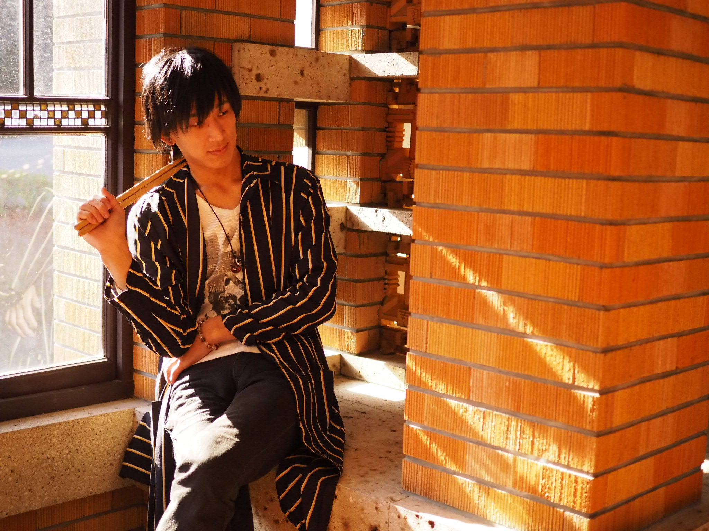
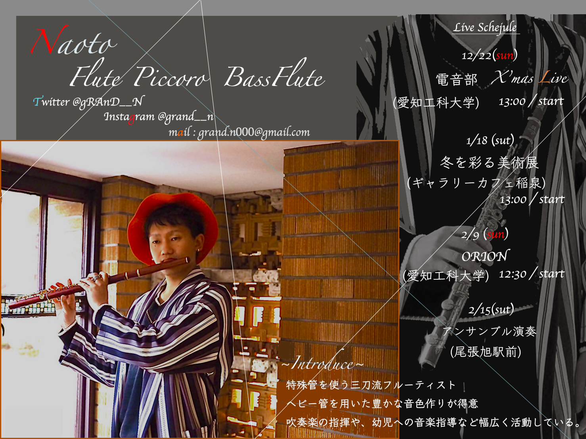
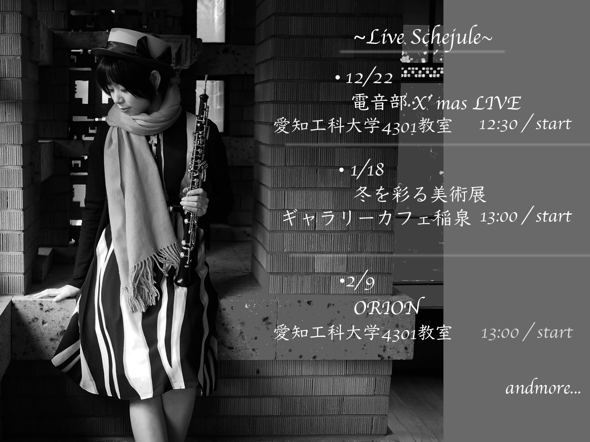

<head>
  
</head>

# About
音楽歴13年、調理歴5年の私がプログラミングを利用し、  
これまでの経験、知識を公開していきます。

## Profile
- [名前] 遠松賢二
- [芸名] 冬馬
- [出身] 岐阜県
- [スキル]プログラミング、音楽(drum,Percussion)、調理

# Skills

【Programming】
  - HTML & CSS
  - PHP
  - Wordpress
  - Javascript
  - Bootstrap
  - GitHub pages
  - markdown
  - Photoshop
  
【Music】
  - Drum Player
  - Drum Adviser
  - Percussionist
  
【調理】
  - 調理師免許

【介護】
  - 介護職員初任者研修

# Works
- [音楽活動]  
  - [orangeblossom HP](https://orangeblossom3.amebaownd.com/)  
  - [orangeblossom Twitter](https://twitter.com/OB8Ensemble)  
  
    
- [作った作品]  
✅Photoshop  
  
  
  

✅Programing
  - [サイト摸写]
  

    
    
    
  

  
  
  - [あなたのいいところ診断](https://touma-cherie.github.io/assessment/assessment.html)  
  - [webアプリケーション]  
<iframe src="https://www.openprocessing.org/sketch/825165/embed/" width="550" height="320"></iframe>  
    
    
- [Youtube]  
    
<iframe width="550" height="320" src="https://www.youtube.com/embed/a7o34Yi7a3Q" frameborder="0" allow="accelerometer; autoplay; encrypted-media; gyroscope; picture-in-picture" allowfullscreen></iframe>  
　　
  
# History 
- 2012年 Jazz singer 『Keiko Lee』と共演  
- 2014年 調理師免許独学取得  
- 2018年 介護職員初任者研修資格取得  
- 2018年 orangeblossom One-manLive 満員御礼  
- 2019年 orange-blossom & そらしの Two-manLive満員御礼

# Contact
- 📨⇨vic_drum432@yahoo.co.jp

- [冬馬のTwitterはこちら](https://twitter.com/)

<a class="twitter-timeline" data-width="430" data-height="630" data-theme="dark" href="https://twitter.com/toumacherie?ref_src=twsrc%5Etfw">Tweets by toumacherie</a> 

